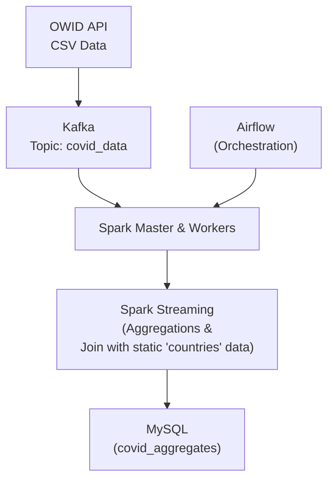

# Real-time data-pipeline-with-spark-kafka
This project implements a robust, end-to-end real-time data pipeline for COVID-19 statistics. It showcases the integration and orchestration of modern big data technologies to ingest, process, enrich, and store streaming data for analytical insights.

## Overview
This pipeline efficiently ingests daily COVID-19 data from the OWID API via **Kafka**, performs real-time **1-minute windowed aggregations** and **joins with static demographic data** within **Spark Structured Streaming**, calculates derived metrics (e.g., new cases per million), and ensures reliable **persistence to MySQL**. The entire data flow is **orchestrated by Airflow** and deployed using **Docker Compose** for streamlined management and reproducibility.

## **Architecture**


## ETL Pipeline
**Extract (Kafka Producer):**
A Python script periodically fetches live COVID-19 data from the OWID API and publishes the data as JSON messages to a Kafka topic (`covid_data`).

**Transform (Spark Structured Streaming):**
A PySpark streaming application consumes data from Kafka in near real-time, applies **time-windowed aggregations**, and **enriches** the stream by joining with a **static countries lookup table** cached from MySQL. Derived metrics, such as *new cases per million*, are calculated during this stage.

**Load (MySQL Sink):**
The transformed and enriched data is written into the `covid_aggregates` table in a **MySQL** database, serving as a central store for downstream analysis or reporting.

## Project Structure

```data-pipeline-with-spark-kafka/
├── docker-compose.yml
├── Dockerfile.airflow
├── Dockerfile.spark_vanilla
├── airflow_home/
│   ├── dags/
│   │   └── spark_consumer_dag.py
│   ├── scripts/
│   │   ├── kafka_producer.py
│   │   └── spark_consumer_kafka.py
│   ├── requirements.txt
├── .gitignore
└── README.md                   
```
## Prerequisites
Docker Desktop

Git

## Getting Started
### Clone the Repository
```bash
git clone https://github.com/arunbalasundar/data-pipeline-with-spark-kafka.git
cd data-pipeline-with-spark-kafka
```

### Build docker images and Start services
```bash
docker-compose up --build --no-cache -d
```

### Airflow setup
```bash
docker exec -it airflow_webserver airflow db migrate
docker exec -it airflow_webserver airflow users create --username airflow --firstname Airflow --lastname User --role Admin --email airflow@example.com --password airflow
```

### Setup MySQL tables
```bash
docker exec -it mysql bash
mysql -u airflow -pairflow airflow
```

```sql
DROP TABLE IF EXISTS covid_aggregates;
CREATE TABLE covid_aggregates (
    window_start DATETIME, window_end DATETIME, location VARCHAR(255),
    total_new_cases_in_window INT, avg_new_cases_per_entry DECIMAL(20, 2),
    max_new_cases_in_window INT, total_cases_sum_in_window BIGINT,
    avg_total_cases_per_entry DECIMAL(20, 2), continent VARCHAR(255),
    population BIGINT, new_cases_per_million_in_window DECIMAL(20, 4),
    processing_time DATETIME DEFAULT CURRENT_TIMESTAMP,
    PRIMARY KEY (window_start, location)
  );
DROP TABLE IF EXISTS countries;
CREATE TABLE countries (
    id INT AUTO_INCREMENT PRIMARY KEY, name VARCHAR(255) NOT NULL UNIQUE,
    population BIGINT, continent VARCHAR(255), iso_code VARCHAR(3)
);
INSERT INTO countries (name, population, continent, iso_code) VALUES
('New Zealand', 5120000, 'Oceania', 'NZL'), ('United States', 331900000, 'North America', 'USA'),
('India', 1400000000, 'Asia', 'IND'), ('Germany', 83200000, 'Europe', 'DEU'),
('Brazil', 215000000, 'South America', 'BRA'), ('Australia', 26000000, 'Oceania', 'AUS'),
('United Kingdom', 67000000, 'Europe', 'GBR'), ('Canada', 38000000, 'North America', 'CAN');
```

### Kafka Topic and Data Creation
```bash
docker exec -it kafka bash -c "kafka-topics.sh --create --topic covid_data --bootstrap-server localhost:9092 --partitions 1 --replication-factor 1
```

## Access Airflow UI: 
Open your web browser and navigate to http://localhost:8080.

### Create Airflow Spark Connection:
Create a Spark connection (Admin > Connections): Conn Id: spark_default, Conn Type: Spark, Master URI: spark://spark-master:7077.

# Running the Pipeline
## Run the producer script:
```bash
cd airflow_home/scripts/
python3 kafka_producer.py
```

## Enable and Trigger Airflow DAG
Run ```spark_kafka_consumer_pipeline``` DAG

## Monitor and Verify
```bash
docker exec -it mysql bash
mysql -u airflow -pairflow airflow
```

```sql
SELECT window_start, location, continent, population, new_cases_per_million_in_window 
FROM covid_aggregates 
WHERE new_cases_per_million_in_window IS NOT NULL 
AND new_cases_per_million_in_window > 0 
LIMIT 20;
```

```sql
SELECT COUNT(*) FROM covid_aggregates;
```
